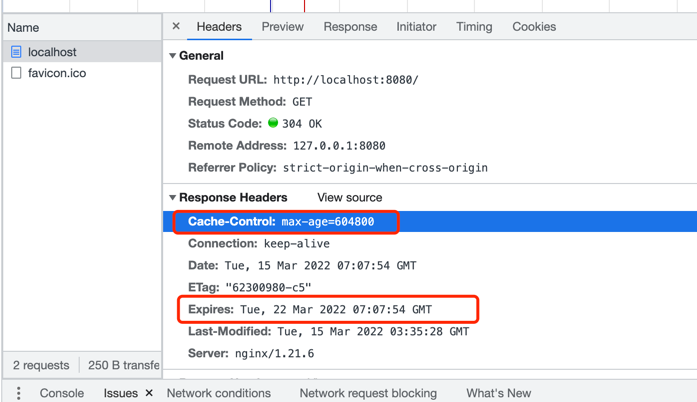

在 docker 中启动 Nginx的步骤 和 Nginx 中配置服务、负载均衡、缓冲区、Cache的属性

[NGINX 配置文件自动生成网站](https://www.digitalocean.com/community/tools/nginx?domains.0.php.php=false&domains.0.routing.index=index.html&domains.0.routing.fallbackHtml=true&global.app.lang=zhCN)
<!--more-->

## 在 docker 中启动 Nginx
### dockerfile

```dockerfile
FROM nginx
COPY static-html-directory /www
COPY nginx.conf /etc/nginx/nginx.conf
```
### 构建

### 运行 & 暴露外部端口

```shell 
docker run --name nginx-server1 -d -p 9999:9999 nginx-server
```

ps: run & start & rm 
```shell
docker run  # Run a command in a **new** container
docker start  # Start one or more stopped containers
docker rm nginx-server
```

### 进入容器查看

```shell
docker exec -it nginx-server /bin/bash
#退出
exit
```

## Nginx 的 context 有哪些
### events

### http
结构：http > server > location > nested location upstream mail

#### server
#### location 
代理/转发
```shell
location /match/here {
    proxy_pass http://example.com;
}

```

设置响应的 header
```shell
proxy_set_header HOST $host;
proxy_set_header X-Forwarded-Proto $scheme;
proxy_set_header X-Real-IP $remote_addr;
proxy_set_header X-Forwarded-For $proxy_add_x_forwarded_for;

location /match/here {
    proxy_pass http://example.com/new/prefix;
}

location /different/match {
    proxy_pass http://example.com;
}
```
##### location 下可配置的 context

```shell
    limit_except GET HEAD {
        # limit_except context
        allow 192.168.1.1/24;
        deny all;
    }
    if (test_condition) {
        # if context
    }
```

## 代理的负载均衡

```shell

upstream backend_hosts {
    least_conn; #[算法] 指定应始终向活动连接数最少的后端提供新连接。这在与后端的连接可能持续一段时间的情况下尤其有用。
    hash $remote_addr$remote_port consistent;
    server host1.example.com weight=3; #权重
    server host2.example.com;
    server host3.example.com;
}

server {
    listen 80;
    server_name example.com;

    location /proxy-me {
        proxy_pass http://backend_hosts;
    }
}
```
## 缓存相关
### proxy buffer
还可以配置一些 proxy buffer 缓冲区 
减少请求时间

### proxy_cache

减少响应时间

### Cache-Control的值

1. no-cache：此指令指定任何缓存的内容在提供给客户端之前必须在每个请求上重新验证。实际上，这会立即将内容标记为过时，但允许它使用重新验证技术来避免再次重新下载整个项目。
2. no-store：该指令表示不能以任何方式缓存内容。如果响应代表敏感数据，则适合设置。
3. public：这将内容标记为公开，这意味着它可以被浏览器和任何中间缓存缓存。对于使用 HTTP 身份验证的请求，private默认情况下会标记响应。此标头会覆盖该设置。
4. private: 这将内容标记为private。私人内容可以由用户的浏览器存储，但不得被任何中间方缓存。这通常用于特定于用户的数据。
5. max-age：此设置配置内容在必须重新验证或从源服务器重新下载内容之前可以缓存的最长期限。从本质上讲，这取代了Expires现代浏览的标题，是确定一段内容新鲜度的基础。此选项以秒为单位取值，最长有效新鲜时间为一年（31536000
   秒）。
6. s-maxage：这个和设置很相似max-age，都是表示可以缓存内容的时间。不同之处在于此选项仅适用于中间缓存。将其与上述相结合允许更灵活的策略构建。
7. must-revalidate: 表示必须严格遵守max-age,s-maxage或表头指示的新鲜度信息。Expires在任何情况下都不能提供过时的内容。这可以防止在网络中断和类似情况下使用缓存的内容。
8. proxy-revalidate：这与上述设置的操作相同，但仅适用于中间代理。在这种情况下，用户的浏览器可能被用于在网络中断的情况下提供陈旧的内容，但中间缓存不能用于此目的。
9. no-transform：此选项告诉缓存在任何情况下都不允许出于性能原因修改接收到的内容。这意味着，例如，缓存无法发送它没有从原始服务器接收到的压缩内容的压缩版本，并且是不允许的。

```shell
location /private {
    expires -1;
    add_header Cache-Control "no-store";
}
```
 --- 
## Cache 示例
在配置文件中设置了 7 天过期


```shell
# 响应头
HTTP/1.1 304 Not Modified
Server: nginx/1.21.6
Date: Tue, 15 Mar 2022 07:07:54 GMT
Last-Modified: Tue, 15 Mar 2022 03:35:28 GMT # 文件修改时间
Connection: keep-alive
ETag: "62300980-c5" #所请求文件的此特定版本的唯一标识符 
Expires: Tue, 22 Mar 2022 07:07:54 GMT #过期时间
Cache-Control: max-age=604800 #7d
```

Cache-Control设置为no-cache，它告诉浏览器始终询问服务器是否有更新版本的文件（使用ETag标头，像以前一样）。

强制刷新可以重新请求

除了ETag文件验证头之外，还有两个缓存控制响应头：Cache-Control和Expires. Cache-Control是较新的版本，具有更多选项Expires，如果您想更好地控制缓存行为，通常会更有用。

```shell
# Expires map 根据文件类型设置过期
map $sent_http_content_type $expires {
    default                    off;
    text/html                  epoch;
    text/css                   max;
    application/javascript     max;
    ~image/                    max;
    ~font/                     max;
}

 expires $expires;
```
