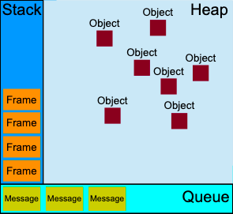

<!--more-->


并发模型与事件循环


### stack
函数调用形成了一个由若干帧组成的栈。
```javascript
function foo(b) {
  let a = 10
  return a + b + 11
}

function bar(x) {
  let y = 3
  return foo(x * y)
}

console.log(bar(7)) //returns 42
```
When calling bar, a first frame is created containing bar's arguments and local variables. When bar calls foo, a second frame is created and pushed on top of the first one containing foo's arguments and local variables. When foo returns, the top frame element is popped out of the stack (leaving only bar's call frame). When bar returns, the stack is empty.
### Heap [堆]
Objects are allocated in a heap which is just a name to denote a large (mostly unstructured) region of memory.
### Queue
一个 JavaScript 运行时包含了一个待处理消息的消息队列。每一个消息都关联着一个用以处理这个消息的回调函数。
### Event loop
