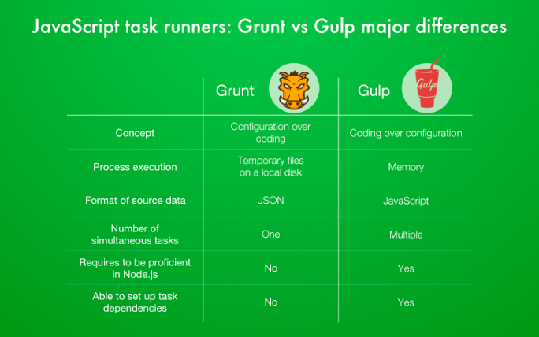

一些有质量的前端常见的面试题总结
<!--more-->

## react

### react hooks 有哪些优缺点？
> 更容易复用代码
> 
> 可以让你在不编写 class 的情况下使用 state 以及其他的 React 特性。
> 
>整个思想改变了 需要转换思想

### useLayoutEffect 和 useEffect 区别是什么？
> useEffect在浏览器渲染完成后执行
> 
> useLayoutEffect在浏览器渲染前执行
> 
> useLayoutEffect总是比useEffect先执行 
> 
> useLayoutEffect里面的任务最好影响了Layout（布局）


### 有接触过哪些移动端跨平台框架？说下jsBridge？
4.说下react-native的原理，原生端和js端是怎么通信的？
工作中遇到过的最难的问题是什么？最后解决了吗？怎么解决的？现在觉得有没有更好的解决方案？
. 反转单向链表怎么做？需要几个指针？都有什么作用？
. Vue 和 React的区别是什么？你觉得哪个好？

###  redux主要解决了什么问题？它的工作原理是什么？
> 解决了组件之间通信问题,使组件和其它组件之间也可以跨层通信，不需要一层一层的把，父组件的数据往下传递。
> 
> 使用action，让action 携带新的数据值派发给store，store 把action 发给reducer 函数，reducer 函数处理新的数据然后返回给store，最后react 组件拿到更新后的数据渲染页面，达到页面更新的目的。

react中state有层级很深，比如a.b.c.d，如果只更新c属性有哪些办法？
```javascript
this.state.c.d[2].e=3;
this.setState(this.state);

```
### immutable.js实现的原理是什么？
如果对象树中一个节点发生变化，只修改这个节点和受它影响的父节点，其它节点则进行共享。

深拷贝对性能的消耗太大了
state 更新时，如果数据没变，你也会去做 virtual dom 的 diff ，这就产生了浪费。这种情况其实很常见
>immutable是一种持久化数据。一旦被创建就不会被修改。修改immutable对象的时候返回新的immutable。但是原数据不会改变。

使用shouldComponentUpdate可以优化性能
```javascript
var map1 = Immutable.fromJS({a:1, b:1, c:{b:{c:{d:{e:7}}}}});
var map2 = Immutable.fromJS({a:1, b:1, c:{b:{c:{d:{e:7}}}}});
Immutable.is(map1, map2);  // true
```
getIn
```javascript
const { fromJS } = require('immutable');
const nested = fromJS({ a: { b: { c: [3, 4, 5] } } });

const nested2 = nested.mergeDeep({ a: { b: { d: 6 } } });
// Map { a: Map { b: Map { c: List [ 3, 4, 5 ], d: 6 } } }

console.log(nested2.getIn(['a', 'b', 'd'])); // 6

```
setIn
```javascript
const { setIn } = require('immutable')
const original = { x: { y: { z: 123 }}}
setIn(original, ['x', 'y', 'z'], 456) // { x: { y: { z: 456 }}}
console.log(original) // { x: { y: { z: 123 }}}
```
#说下csrf 和 xss，分别举例说明，各有什么解决办法？
对提交的数据进行检测和过滤


## javascript 浏览器原理
### Cookie的同源策略是怎么样的，跨域情况下如何携带Cookie

> 1. https http 不同源
> 2. 端口 不同 不同源
> 3. 域名 不同 不同源

```javascript
// 被请求的站点
Access-Control-Allow-Origin: a.com //这里需要换成相应的发起请求的域名
Access-Control-Allow-Credentials: true
// 请求站点
xhr = new XMLHttpRequest();
xhr.withCredentials= true;  //关键句
xhr.open("GET", url);
xhr.send();
```
### 有用过哪些跨平台框架，react-native中原生端和js端怎么进行通信的？

### 假设有一个非常复杂耗时的逻辑，代码逻辑已经最优了前提下要你优化，你有哪些办法？

> 使用WebWorker，把耗时的任务放到一个子线程里去执行，完成后通知主线程

### 说下浏览器的进程、线程模型，chrome浏览器有多少个进程？线程模型中的每个线程都是干嘛用的？
> 有一个主控进程，以及每一个tab页面都会新开一个进程，线程有GUI线程、JS引擎线程、事件触发线程
、定时器线程、网络请求线程
### 说下 js的内存泄漏，什么情况容易出现内存泄漏？怎么解决？垃圾回收机制是怎么样的？
>js有垃圾回收机制，使用的是引用计数
>
> 如果一个值不再需要了，引用数却不为0，垃圾回收机制无法释放这块内存，从而导致内存泄漏
> 例如声明了一个数组 后面确没有使用

### 自己的项目做了哪些性能优化？除了webpack打包之类的优化外，http层面有做了哪些优化？gzip如何开启？gzip有多少个级别？
> 代码拆分、gzip
> 
> 配置gzip打包、nginx开启配置
> 
> GZIP，可以配置为1-9 之间的级别，其中1 表示最快压缩(较少压缩)，9 表示最慢压缩方法(最佳压缩)。
### 13. 用二分法移除掉一个字符串中所有的字母字符。

3. 随机生成100w正负整数存储下来，记录时间t1；然后把这100w数据中的负数全去掉，记录时间t2；然后记录总共耗时t3 = t2 - t1。

### 4. 在耗时t3的基础上优化下，使t4的耗时只有t3的70%; 在t4的耗时基础下再优化，使t5的耗时只有t4的70%...

### react中的diff算法的原理？传统的diff算法是怎么实现的？

6. 说出一个react的特性？它的原理是什么？（我答的fiber）

### 你们的前端项目主要用的是ES版本是多少？说出ES7中的3个性特性并说出应用场景？说出ES8中的三个新特性并说出应用场景？
> ES2020
> 1. trimStart/trimEnd
> 2. Object.entries/Object.fromEntries
> 3. ...
> 4. [].flat /5. [].flatMap

### 为什么说https是安全的？https的证书校验过程是怎么样的？（这里一定要说的非常非常详细）证书校验用到了哪些算法？
   如果服务器给客户端的消息是密文的，只有服务器和客户端才能读懂，就可以保证数据的保密性。 同时，在交换数据之前，验证一下对方的合法身份，就可以保证通信双方的安全。 （和我们平时开发中RSA加签验签，加密解密的过程比较像）。 HTTPS就是利用了类似的原理来保证通信的安全性。
> 我们在访问 https://www.site.com 时，浏览器会得到一个 TLS 证书，这个数字证书用于证明我们正在访问的网站和证书的持有者是匹配的，否则因为身份认证无法通过，连接也就无法建立。
10. https一定是安全的吗？（考察https中间人劫持），有什么解决办法？

11. 说出http2中至少三个新特性？你们有在实际中用过吗？


### http缓存机制问题，浏览器的默认缓存时间是多久？
（访问时间 - 最后修改时间） ÷  10

##五面

### 自我介绍

## 为什么要离职
### 要你设计一个前端监控方案，你打算怎么做。


### ES6 Modules 相对于 CommonJS 的优势是什么？
   
### 静态代码分析

### Object.defineProperty 有哪几个参数？各自都有什么作用？
> Object.defineProperty(obj, prop, descriptor)

configurable
当且仅当该属性的 configurable 键值为 true 时，该属性的描述符才能够被改变，同时该属性也能从对应的对象上被删除。
默认为 false。
enumerable
当且仅当该属性的 enumerable 键值为 true 时，该属性才会出现在对象的枚举属性中。
默认为 false。
数据描述符还具有以下可选键值：

value
该属性对应的值。可以是任何有效的 JavaScript 值（数值，对象，函数等）。
默认为 undefined。
writable
当且仅当该属性的 writable 键值为 true 时，属性的值，也就是上面的 value，才能被赋值运算符 (en-US)改变。
默认为 false。

### Object.defineProperty 和 ES6 的 Proxy 有什么区别？

33、 ES6 中 Symbol、Map、Decorator 的使用场景有哪些？或者你在哪些库的源码里见过这些 API 的使用？

34、 为什么要使用 TypeScript ? TypeScript 相对于 JavaScript 的优势是什么？
35、 TypeScript 中 const 和 readonly 的区别？枚举和常量枚举的区别？接口和类型别名的区别？

36、 TypeScript 中 any 类型的作用是什么？
37、 TypeScript 中 any、never、unknown 和 void 有什么区别？

38、 TypeScript 中 interface 可以给 Function / Array / Class（Indexable）做声明吗？
39、 TypeScript 中可以使用 String、Number、Boolean、Symbol、Object 等给类型做声明吗？

40、 TypeScript 中的 this 和 JavaScript 中的 this 有什么差异？
41、 TypeScript 中使用 Unions 时有哪些注意事项？
42、 TypeScript 如何设计 Class 的声明？
43、 TypeScript 中如何联合枚举类型的 Key?
44、 TypeScript 中 ?.、??、!.、_、** 等符号的含义？
45、 TypeScript 中预定义的有条件类型有哪些？
46、 简单介绍一下 TypeScript 模块的加载机制？
47、 简单聊聊你对 TypeScript 类型兼容性的理解？抗变、双变、协变和逆变的简单理解？
48、 TypeScript 中对象展开会有什么副作用吗？
49、 TypeScript 中 interface、type、enum 声明有作用域的功能吗？
50、 TypeScript 中同名的 interface 或者同名的 interface 和 class 可以合并吗？
51、 如何使 TypeScript 项目引入并识别编译为 JavaScript 的 npm 库包？

## React
57、 React 中高阶函数和自定义 Hook 的优缺点？
58、 简要说明 React Hook 中 useState 和 useEffect 的运行原理？
60、 React Hook 中 useEffect 有哪些参数，如何检测数组依赖项的变化？
61、 React 的 useEffect 是如何监听数组依赖项的变化的？
62、 React Hook 和闭包有什么关联关系？
63、 React 中 useState 是如何做数据初始化的？
64、 列举你常用的 React 性能优化技巧？
85、如何发布一个支持 Tree Shaking 机制的 Npm 包？
86、Npm 包中 peerDependencies 的作用是什么？
87、如何优雅的调试需要发布的 Npm 包？JavaScriptDecorator
88、在设计一些库包时如何生成版本日志？
89、了解 Git （Submodule）子模块吗？简单介绍一下 Git 子模块的作用？
90、Git 如何修改已经提交的 Commit 信息？
91、Git 如何撤销 Commit 并保存之前的修改？
92、Git 如何 ignore 被 commit 过的文件？
93、在使用 Git 的时候如何规范 Git 的提交说明（Commit 信息）？
94、简述符合 Angular 规范的提交说明的结构组成？
95、Commit 信息如何和 Github Issues 关联？

96、Git Hook 在项目中哪些作用？
97、Git Hook 中客户端和服务端钩子各自用于什么作用？
98、Git Hook 中常用的钩子有哪些？
99、pre-commit 和 commit-msg 钩子的区别是什么？各自可用于做什么？
100、husky 以及 ghook 等工具制作 Git Hook 的原理是什么？


101、如何设计一个通用的 Git Hook ？
102、Git Hook 可以采用 Node 脚本进行设计吗？如何做到？
103、如何确保别人上传的代码没有 Lint 错误？如何确保代码构建没有 Lint 错误？
104、如何在 Vs Code 中进行 Lint 校验提示？如何在 Vs Code 中进行 Lint 保存格式化？
###### 105、ESLint 和 Prettier 的区别是什么？两者在一起工作时会产生问题吗？
eslint（包括其他一些lint 工具）的主要功能包含代码格式的校验，代码质量的校验。 
Prettier 只是代码格式的校验（并格式化代码），不会对代码质量进行校验。 
代码格式问题通常指的是：单行代码长度、tab长度、空格、逗号表达式等问题。
代码质量问题指的是：未使用变量、三等号、全局变量声明等问题。eg: no-unused-vars、no-implicit-globals 以及 prefer-promise-reject-errors

###### 106、如何有效的识别 ESLint 和 Prettier 可能产生冲突的格式规则？如何解决此类规则冲突问题？
eslint-config-prettier + eslint-plugin-prettier。
eslint-config-prettier 的作用是关闭eslint中与prettier相互冲突的规则。
eslint-plugin-prettier 的作用是赋予eslint用prettier格式化代码的能力。

107、在通常的脚手架项目中进行热更新（hot module replacement）时如何做到 ESLint 实时打印校验错误信息？

###### 108、谈谈你对 SourceMap 的了解？
SourceMap是一个从转换的源映射到原始源的文件，使浏览器能够重建原始源，并在调试器中显示重建的原始源。

109、如何调试 Node.js 代码？如何调试 Node.js TypeScript 代码？在浏览器中如何调试 Node.js 代码？

110、列举你知道的所有构建工具并说说这些工具的优缺点？这些构建工具在不同的场景下应该如何选型？
虽然配置Grunt可能比配置Gulp需要更长的时间，但Grunt对更多用户来说更友好，因为它更多地依赖于配置而不是代码。此外，虽然Gulp更容易阅读，但许多人觉得Grunt代码更容易编写。
Grunt 使用临时文件。Gulp 利用 Node 流。
Grunt 一项一项地执行任务。Gulp 同时执行多个任务。

113、你所知道的测试有哪些测试类型？
114、你所知道的测试框架有哪些？
115、什么是 e2e 测试？有哪些 e2e 的测试框架？
116、假设现在有一个插入排序算法，如何对该算法进行单元测试？
网络
117、CDN 服务如何实现网络加速？
118、WebSocket 使用的是 TCP 还是 UDP 协议？
119、什么是单工、半双工和全双工通信？
120、简单描述 HTTP 协议发送一个带域名的 URL 请求的协议传输过程？（DNS、TCP、IP、链路）
121、什么是正向代理？什么是反向代理？
122、Cookie 可以在服务端生成吗？Cookie 在服务端生成后的工作流程是什么样的？
123、Session、Cookie 的区别和关联？如何进行临时性和永久性的 Session 存储？
124、设置 Cookie 时候如何防止 XSS 攻击？
125、简单描述一下用户免登陆的实现过程？可能会出现哪些安全性问题？一般如何对用户登录的密码进行加密？
126、HTTP 中提升传输速率的方式有哪些？常用的内容编码方式有哪些？
127、传输图片的过程中如果突然中断，如何在恢复后从之前的中断中恢复传输？
128、什么是代理？什么是网关？代理和网关的作用是什么？
129、HTTPS 相比 HTTP 为什么更加安全可靠？
130、什么是对称密钥（共享密钥）加密？什么是非对称密钥（公开密钥）加密？哪个更加安全？
131、你觉得 HTTP 协议目前存在哪些缺点？

148、SSR 技术和 SPA 技术的各自的优缺点是什么？
146、GraphQL 与 Restful 的区别，它有什么优点
171、使用 TypeScript 语法将没有层级的扁平数据转换成树形结构的数据
172、实现一个简易的模板引擎


如何实现多页面数据共享
追问：如何实现不同域名下的多页面数据共享
追问：如何用localStorage实现不同域名下的多页面数据共享

分析Axios源码实现
React与Vue框架比较
JSBridge实现原理
Scheme深度链接实现原理

谈谈对箭头函数的了解
canvas的一些图像操作为什么对图片有跨域限制
