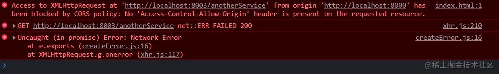
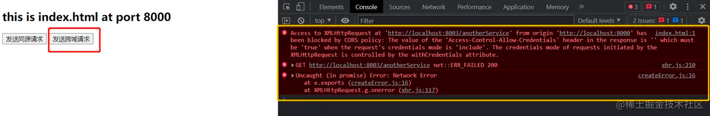

一些有质量的前端常见的面试题总结

<!--more-->

## JS浏览器原理

### Cookie的同源策略是怎么样的，跨域情况下如何携带Cookie

> 1. https http 不同源
> 2. 端口 不同 不同源
> 3. 域名 不同 不同源

```javascript
// 被请求的站点
// Access - Control - Allow - Origin
// a.com //这里需要换成相应的发起请求的域名
// Access - Control - Allow - Credentials
true
// 请求站点
xhr = new XMLHttpRequest();
xhr.withCredentials = true;  //关键句
xhr.open("GET", url);
xhr.send();
```

### 有用过哪些跨平台框架，react-native中原生端和js端怎么进行通信的？

### 假设有一个非常复杂耗时的逻辑，代码逻辑已经最优了前提下要你优化，你有哪些办法？

> 使用WebWorker，把耗时的任务放到一个子线程里去执行，完成后通知主线程

### 说下浏览器的进程、线程模型，chrome浏览器有多少个进程？线程模型中的每个线程都是干嘛用的？

> 有一个主控进程，以及每一个tab页面都会新开一个进程，线程有GUI线程、JS引擎线程、事件触发线程
> 、定时器线程、网络请求线程

### 说下 js的内存泄漏，什么情况容易出现内存泄漏？怎么解决？垃圾回收机制是怎么样的？

> js有垃圾回收机制，使用的是引用计数
>
> 如果一个值不再需要了，引用数却不为0，垃圾回收机制无法释放这块内存，从而导致内存泄漏
> 例如声明了一个数组 后面确没有使用

### 自己的项目做了哪些性能优化？除了webpack打包之类的优化外，http层面有做了哪些优化？gzip如何开启？gzip有多少个级别？

代码拆分、gzip
配置gzip打包、nginx开启配置 
GZIP，可以配置为1-9 之间的级别，其中1 表示最快压缩(较少压缩)，9 表示最慢压缩方法(最佳压缩)。

### 用二分法移除掉一个字符串中所有的字母字符。

### 随机生成100w正负整数存储下来，记录时间t1；然后把这100w数据中的负数全去掉，记录时间t2；然后记录总共耗时t3 = t2 - t1。

### 在耗时t3的基础上优化下，使t4的耗时只有t3的70%; 在t4的耗时基础下再优化，使t5的耗时只有t4的70%...

### react中的diff算法的原理？传统的diff算法是怎么实现的？

### 说出一个react的特性？它的原理是什么？（我答的fiber）

### 你们的前端项目主要用的是ES版本是多少？说出ES7中的3个性特性并说出应用场景？说出ES8中的三个新特性并说出应用场景？

> ES2020
>
> 1. trimStart/trimEnd
> 2. Object.entries/Object.fromEntries
> 3. ...
> 4. [].flat /5. [].flatMap

### 为什么说https是安全的？https的证书校验过程是怎么样的？（这里一定要说的非常非常详细）证书校验用到了哪些算法？

如果服务器给客户端的消息是密文的，只有服务器和客户端才能读懂，就可以保证数据的保密性。 同时，在交换数据之前，验证一下对方的合法身份，就可以保证通信双方的安全。 （和我们平时开发中RSA加签验签，加密解密的过程比较像）。
HTTPS就是利用了类似的原理来保证通信的安全性。

> 我们在访问 https://www.site.com 时，浏览器会得到一个 TLS 证书，这个数字证书用于证明我们正在访问的网站和证书的持有者是匹配的，否则因为身份认证无法通过，连接也就无法建立。

### https一定是安全的吗？（考察https中间人劫持），有什么解决办法？
http://localhost:1313/blog/network/https/
### 说出http2中至少三个新特性？你们有在实际中用过吗？
[http2](/blog/network/http2/)

### http缓存机制问题，浏览器的默认缓存时间是多久？

（访问时间 - 最后修改时间） ÷ 10

## 五面

### 自我介绍

## 为什么要离职

### 要你设计一个前端监控方案，你打算怎么做。

### ES6 Modules 相对于 CommonJS 的优势是什么？
CommonJS 模块输出的是一个值的拷贝，ES6 模块输出的是值的引用
### 静态代码分析

### Object.defineProperty 有哪几个参数？各自都有什么作用？

> Object.defineProperty(obj, prop, descriptor)

configurable 当且仅当该属性的 configurable 键值为 true 时，该属性的描述符才能够被改变，同时该属性也能从对应的对象上被删除。 默认为 false。 enumerable 当且仅当该属性的 enumerable
键值为 true 时，该属性才会出现在对象的枚举属性中。 默认为 false。 数据描述符还具有以下可选键值：

value 该属性对应的值。可以是任何有效的 JavaScript 值（数值，对象，函数等）。 默认为 undefined。 writable 当且仅当该属性的 writable 键值为 true 时，属性的值，也就是上面的
value，才能被赋值运算符 (en-US)改变。 默认为 false。

### Object.defineProperty 和 ES6 的 Proxy 有什么区别？

33、 ES6 中 Symbol、Map、Decorator 的使用场景有哪些？或者你在哪些库的源码里见过这些 API 的使用？

## TypeScript

### 为什么要使用 TypeScript ? TypeScript 相对于 JavaScript 的优势是什么？

对于解释型的JavaScript来说，所有断言和错误都将发生在运行时，这将使得部分网页脚本无法继续运行下去。 TypeScript 在 JavaScript 的基础上增加静态类型定义和编译时检查，通过编译，可以将 TypeScript
转译为 JavaScript。

1. TypeScript 的静态类型和编译大大降低了发生运行时错误的可能性，同时作为超集，TypeScript 依旧保留了 JavaScript 的灵活性，可谓是一举两得。
2. 类型可以一定程度上充当文档;
3. IDE自动填充，自动联想

### 35、 TypeScript 中 const 和 readonly 的区别？枚举和常量枚举的区别？

1. const 字段只能在该字段的声明中初始化。 readonly 字段可以在声明或构造函数中初始化。 因此，根据所使用的构造函数，readonly 字段可能具有不同的值。
2. const 字段是编译时常数，而readonly 字段可用于运行时常数。
3. const 和 readonly: const可以防止变量的值被修改，readonly可以防止变量的属性被修改。

枚举和常量枚举 默认真实值是数字 可以指定枚举的值

### 接口和类型别名的区别？

1. 声明语法不同、接口可以定义多次 type 能使用 in 关键字生成映射类型，但 interface 不行。

```ts
type Keys = "firstname" | "surname"

type DudeType = {
    [key in Keys]: string
}

const test: DudeType = {
    firstname: "Pawel",
    surname: "Grzybek"
}

```

2. 扩展语法不同

都可以被 class implements

### TypeScript 中 any 类型的作用是什么？

### TypeScript 中 any、never、unknown 和 void 有什么区别？

any 这应该是 typescript 中最开始就会接触到的类型，顾名思义：任意类型，这也是 ts 中不写类型申明时的默认类型，即不作任何约束，编译时会跳过对其的类型检查， void void 表示无任何类型，正好与 any
相反，没有类型，如果是函数则应没有返回值或者返回 undefined，和 C 等语言中的无返回值函数申明类似：

unknown 顾名思义，unknown 表示未知类型，是 typescript 3.0 中引入的新类型，即写代码的时候还不清楚会得到怎样的数据类型，如服务器接口返回的数据，JSON.parse() 返回的结果等；该类型相当于
any，可以理解为官网指定的替代 any 类型的安全版本（因为不提倡直接使用 any 类型）； 比 any 限制多一点 不允许执行方法3

never 永不存在的值的类型 never的作用是可以确保条件收窄不会遗漏，如有遗漏会出现类型报错

```ts

interface Foo {
    type: 'foo'
}

interface Bar {
    type: 'bar'
}

//union type:
type All = Foo | Bar

function handleValue(val: All) {
    switch (val.type) {
        case 'foo':
            // 这里 val 被收窄为 Foo
            break
        case 'bar':
            // val 在这里是 Bar
            break
        default:
            // val 在这里是 never
            const exhaustiveCheck: never = val
            break
    }
}
```

后来有一天改了 All 的类型：type All = Foo | Bar | Baz 然而忘记了在 handleValue 里面加上针对 Baz 的处理逻辑，这个时候在 default branch 里面 val 会被收窄为
Baz，导致无法赋值给 never，产生一个编译错误。所以通过这个办法，你可以确保 handleValue 总是穷尽 (exhaust) 了所有 All 的可能类型。

### TypeScript 中 interface 可以给 Function / Array / Class（Indexable）做声明吗？

可以，interface 能够描述 JavaScript 对象的任何形式，包括函数

```ts
/* 可以 */

// 函数声明
interface Say {
    (name: string): viod;
}

let say: Say = (name: string): viod => {
}

// Array 声明
interface NumberArray {
    [index: number]: number;
}

let fibonacci: NumberArray = [1, 1, 2, 3, 5];

// Class 声明
interface PersonalIntl {
    name: string

    sayHi(name: string): string
}

```

### TypeScript 中可以使用 String、Number、Boolean、Symbol、Object 等给类型做声明吗？

```ts
/* 可以 */
let name: string = "bob";
let decLiteral: number = 6;
let isDone: boolean = false;
let sym: symbol = Symbol();

interface Person {
    name: string;
    age: number;
}

```

### TypeScript 中的 this 和 JavaScript 中的 this 有什么差异？

TypeScript：noImplicitThis: true 的情况下，必须去声明 this 的类型，才能在函数或者对象中使用this。

### TypeScript 中使用 Unions 时有哪些注意事项？

不要去访问非共有的属性和方法

```ts
function getLength(something: string | number): number {
    return something.length;
}

// index.ts(2,22): error TS2339: Property 'length' does not exist on type >'string | number'.
//   Property 'length' does not exist on type 'number'.

function getString(something: string | number): string {
    return something.toString();
}

// 公共方法和属性可以访问
```

### TypeScript 中 ?.、??、!.、_、** 等符号的含义？

1. ?. 是 可选链 ，可以看成是高级的 . 。比如 a?.b
2. ?? 是 空值合并运算符 ，可以看成是高级的 ||。比 || 高级在于：除了null和undefined，都属于空值，不再像 || 一样不能区分false，''，0了。
3. ! 有点像 typescript 中的 as。比如 let a: undefined | {a: 1} = xxxxx; let b: number = a!
   .a，是为了缩小类型检查范围，告诉ide这个变量不为null或undefined。
4. _ 是可以看成是特殊的语法糖，或者不算语法糖，只是为了方便读数字。比如 100000000 === 1_0000_0000。
5. ** 是幂运算符。3**2 === 9。

### TypeScript 中预定义的有条件类型有哪些？ Predefined conditional types

Exclude<T, U> -- 从 T 中剔除可以复制给 U 的类型。 Extract<T, U> -- 提取 T 中可以赋值给 U 的类型。 NonNullable<T> -- 从 T 中剔除 null 和 undefined。
ReturnType<T> -- 获取函数返回值类型。 InstanceType<T> -- 获取构造函数类型的实例类型。

### 简单介绍一下 TypeScript 模块的加载机制？

### 简单聊聊你对 TypeScript 类型兼容性的理解？抗变、双变、协变和逆变的简单理解？

我们将基础类型叫做T，复合类型叫做Comp<T>：

协变 (Covariant)：协变表示Comp<T>类型兼容和T的一致。 Dog是Animal，那Array<Dog>自然也是Array<Animal>

逆变 (Contravariant)：逆变表示Comp<T>类型兼容和T相反。 双向协变 (Bivariant)：双向协变表示Comp<T>类型与T类型双向兼容。 不变 (Invariant)：不变表示Comp<T>
类型与T类型双向都不兼容。

```ts
interface SuperType {
    base: string;
}

interface SubType extends SuperType {
    addition: string;
};
```

```ts
// Covariant 协变
type Covariant<T> = T[];
let coSuperType: Covariant<SuperType> = [];
let coSubType: Covariant<SubType> = [];
coSuperType = coSubType; // 正常 好理解的 父集兼容子集
```

```ts
// Contravariant --strictFunctionTypes true 
// 逆变
type Contravariant<T> = (p: T) => void;
let contraSuperType: Contravariant<SuperType> = function (p) {
}
let contraSubType: Contravariant<SubType> = function (p) {
}
contraSubType = contraSuperType; //子集兼容了父集
```

```ts
// Bivariant --strictFunctionTypes false 
// 双向协变
type Bivariant<T> = (p: T) => void;
let biSuperType: Bivariant<SuperType> = function (p) {
}
let biSubType: Bivariant<SubType> = function (p) {
}
// both are ok
biSubType = biSuperType;
biSuperType = biSubType; //双向都兼容

```

```ts
// Invariant --strictFunctionTypes true
// 不变
type Invariant<T> = { a: Covariant<T>, b: Contravariant<T> };
let inSuperType: Invariant<SuperType> = {a: coSuperType, b: contraSuperType}
let inSubType: Invariant<SubType> = {a: coSubType, b: contraSubType}
// both are not ok
inSubType = inSuperType;
inSuperType = inSubType;
```



### TypeScript 中对象展开会有什么副作用吗？

49、 TypeScript 中 interface、type、enum 声明有作用域的功能吗？ 50、 TypeScript 中同名的 interface 或者同名的 interface 和 class 可以合并吗？ 51、 如何使
TypeScript 项目引入并识别编译为 JavaScript 的 npm 库包？

## React

### react hooks 有哪些优缺点？

> 更容易复用代码
>
> 可以让你在不编写 class 的情况下使用 state 以及其他的 React 特性。
>
> 整个思想改变了 需要转换思想

### useLayoutEffect 和 useEffect 区别是什么？

 useEffect在浏览器渲染完成后执行
 useLayoutEffect在浏览器渲染前执行
 useLayoutEffect总是比useEffect先执行 
 useLayoutEffect里面的任务最好影响了Layout（布局）

### 有接触过哪些移动端跨平台框架？说下jsBridge？

4.说下react-native的原理，原生端和js端是怎么通信的？ 工作中遇到过的最难的问题是什么？最后解决了吗？怎么解决的？现在觉得有没有更好的解决方案？ . 反转单向链表怎么做？需要几个指针？都有什么作用？ . Vue 和
React的区别是什么？你觉得哪个好？

### redux主要解决了什么问题？它的工作原理是什么？

解决了组件之间通信问题,使组件和其它组件之间也可以跨层通信，不需要一层一层的把，父组件的数据往下传递。

使用action，让action 携带新的数据值派发给store，store 把action 发给reducer 函数，reducer 函数处理新的数据然后返回给store，最后react 组件拿到更新后的数据渲染页面，达到页面更新的目的。

react中state有层级很深，比如a.b.c.d，如果只更新c属性有哪些办法？

```javascript
this.state.c.d[2].e = 3;
this.setState(this.state);
```

### immutable.js实现的原理是什么？

如果对象树中一个节点发生变化，只修改这个节点和受它影响的父节点，其它节点则进行共享。 深拷贝对性能的消耗太大了 state 更新时，如果数据没变，你也会去做 virtual dom 的 diff ，这就产生了浪费。这种情况其实很常见

> immutable是一种持久化数据。一旦被创建就不会被修改。修改immutable对象的时候返回新的immutable。但是原数据不会改变。

使用shouldComponentUpdate可以优化性能

```javascript
var map1 = Immutable.fromJS({a: 1, b: 1, c: {b: {c: {d: {e: 7}}}}});
var map2 = Immutable.fromJS({a: 1, b: 1, c: {b: {c: {d: {e: 7}}}}});
Immutable.is(map1, map2);  // true
```

getIn

```javascript
const {fromJS} = require('immutable');
const nested = fromJS({a: {b: {c: [3, 4, 5]}}});

const nested2 = nested.mergeDeep({a: {b: {d: 6}}});
// Map { a: Map { b: Map { c: List [ 3, 4, 5 ], d: 6 } } }

console.log(nested2.getIn(['a', 'b', 'd'])); // 6

```

setIn

```javascript
const {setIn} = require('immutable')
const original = {x: {y: {z: 123}}}
setIn(original, ['x', 'y', 'z'], 456) // { x: { y: { z: 456 }}}
console.log(original) // { x: { y: { z: 123 }}}
```

# 说下csrf 和 xss，分别举例说明，各有什么解决办法？

对提交的数据进行检测和过滤

### React 中高阶函数和自定义 Hook 的优缺点？

通过自定义hooks来复用状态，解决了类组件有些时候难以复用逻辑的问题 虽然状态(from useState)和副作用(useEffect)的存在依赖于组件，但它们可以在组件外部进行定义。这点是class
component做不到的，你无法在外部声明state和副作用（如componentDidMount）。

上面这两点，高阶组件也能做到。但高阶组件的缺点是：

1. 来源不清晰：高阶组件是通过增强组件的props（赋予一个新的属性或者方法到组件的props属性）， 实现起来比较隐式。你难以区分这个props是来自哪个高阶组件。
2. 高阶组件需要实例化一个父组件来实现，不管是在代码量还是性能上，都不如hooks。
3. 依赖不清晰：高阶组件对入参的依赖是隐式的，入参发生在看不到的上层的高阶组件里面。
4. 命名冲突：高阶组件太多时，容易发生命名冲突。

### 简要说明 React Hook 中 useState 和 useEffect 的运行原理？

60、 React Hook 中 useEffect 有哪些参数，如何检测数组依赖项的变化？ 61、 React 的 useEffect 是如何监听数组依赖项的变化的？ 62、 React Hook 和闭包有什么关联关系？ 63、
React 中 useState 是如何做数据初始化的？ 64、 列举你常用的 React 性能优化技巧？ 85、如何发布一个支持 Tree Shaking 机制的 Npm 包？ 86、Npm 包中 peerDependencies
的作用是什么？ 87、如何优雅的调试需要发布的 Npm 包？JavaScriptDecorator 88、在设计一些库包时如何生成版本日志？

## Git相关

### 了解 Git （Submodule）子模块吗？简单介绍一下 Git 子模块的作用？
子模块允许你将一个Git 仓库作为另一个Git 仓库的子目录。 它能让你将另一个仓库克隆到自己的项目中，同时还保持提交的独立。 .gitmodules 文件保存了项目URL 与已经拉取的本地目录之间的映射，这样就能知道子模块在哪获取。 如果有多个子模块，该文件中就会有多条记录。
### Git 如何修改已经提交的 Commit 信息？

git rebase -i 列出commit 列表 找到需要修改的commit 记录，把 pick 修改为 edit 或 e ， :wq 保存退出 修改commit 的具体信息 git commit --amend ，保存并继续下一条
git rebase --continue ，直到全部完成

### Git 如何撤销 Commit 并保存之前的修改？

1.查看commit： git log --pretty=oneline 2.撤销到上一个commit，但是保存当前的修改。 commit git reset --soft < 重建分支，进行提交。

### Git 如何 ignore 被 commit 过的文件？

1. 删除 track 的文件(已经 commit 的文件) git rm 要忽略的文件 ...
2. 在 .gitignore 文件中添加忽略规则 ...
3. 推送到远程仓库是 ignore 规则对于其他开发者也能生效: git push [remote]

### 在使用 Git 的时候如何规范 Git 的提交说明（Commit 信息）？

docs、style、fix、feat

### Commit 信息如何和 Github Issues 关联？

在注释中包含issue编号，#issue_id 自动关闭issue close #issue_id fix #issue_id

### Git Hook 在项目中哪些作用？

本地钩子： pre-commit prepare-commit-msg commit-msg post-commit post-checkout pre-rebase

| 钩子               | 时机                                                   | 备注                                                                     |
| -------------------- | -------------------------------------------------------- | -------------------------------------------------------------------------- |
| pre-commit         | 在键入提交信息前运行                                   | git commit --no-verify 可以跳过 ,格式自动检查 eslint 自动检查           |
| prepare-commit-msg | 钩子在启动提交信息编辑器之前，默认信息被创建之后运行。 | 你可以结合提交模板来使用它，动态地插入信息。                             |
| commit-msg         |                                                        | 钩子接收一个参数，此参数即上文提到的，存有当前提交信息的临时文件的路径。 |
| post-commit        | 最后运行                                               | 一般用于通知                                                             |

### Git Hook 中客户端和服务端钩子各自用于什么作用？

服务器钩子： 服务器端钩子在推送到服务器之前和之后运行 可以在 push 之前检查 【拒绝 push】 或者在 push 之后进行其他操作或通知

| 钩子               | 时机                         | 备注                                           |
| -------------------- | ------------------------------ | ------------------------------------------------ |
| pre-receive\update | 最先被调用                   | 如果它以非零值退出，所有的推送内容都不会被接受 |
| post-receive       | 更新其他系统服务或者通知用户 | 服务器端钩子                                   |

### pre-commit 和 commit-msg 钩子的区别是什么？各自可用于做什么？

pre-commit 在提交前，验证代码

### husky 以及 ghook 等工具制作 Git Hook 的原理是什么？

你在.git/hooks中创建了一些hooks，你希望共享给队友，但.git/hooks文件夹并不会提交到远端，无奈只能拷贝。

```json
{
  "husky": {
    "hooks": {
      "pre-commit": "eslint"
    }
  }
}
```

### 如何设计一个通用的 Git Hook ？

### Git Hook 可以采用 Node 脚本进行设计吗？如何做到？

可以在冲突前先解决冲突再提交

```json
{
  "husky": {
    "hooks": {
      "pre-commit": "node git-hooks/pre-commit"
    }
  }
}
```

### 如何确保别人上传的代码没有 Lint 错误？如何确保代码构建没有 Lint 错误？

dev、build 时抛出 warn 、error

commit 前检查

### 105、ESLint 和 Prettier 的区别是什么？两者在一起工作时会产生问题吗？

eslint（包括其他一些lint 工具）的主要功能包含代码格式的校验，代码质量的校验。 Prettier 只是代码格式的校验（并格式化代码），不会对代码质量进行校验。

代码格式问题通常指的是：单行代码长度、tab长度、空格、逗号表达式等问题。 代码质量问题指的是：未使用变量、三等号、全局变量声明等问题。eg: no-unused-vars、no-implicit-globals 以及
prefer-promise-reject-errors

### 106、如何有效的识别 ESLint 和 Prettier 可能产生冲突的格式规则？如何解决此类规则冲突问题？

eslint-config-prettier + eslint-plugin-prettier。 eslint-config-prettier 的作用是关闭eslint中与prettier相互冲突的规则。
eslint-plugin-prettier 的作用是赋予eslint用prettier格式化代码的能力。

### 107、在通常的脚手架项目中进行热更新（hot module replacement）时如何做到 ESLint 实时打印校验错误信息？

在 webpack dev config 中添加 next.js 示例

```js
    webpack: (config, {dev}) => {
    if (dev) {
        config.plugins.push(new ESLintPlugin({
            extensions: ['js', 'mjs', 'jsx', 'ts', 'tsx'],
        }))
    }
    return config
}
```

### 108、谈谈你对 SourceMap 的了解？

SourceMap是一个从转换的源映射到原始源的文件，使浏览器能够重建原始源，并在调试器中显示重建的原始源。

混淆压缩后 debug 困难。有 source map，出错的时候，除错工具将直接显示原始代码

编译工具 通过配置可生成 sourcemap

### 如何调试 Node.js 代码？如何调试 Node.js TypeScript 代码？

跑 test debug

### 在浏览器中如何调试 Node.js 代码？

Nodejs v6.3+ 的版本提供了两个用于调试的协议：v8 Debugger Protocol 和 v8 Inspector Protocol 可以使用第三方的 Client/IDE 等监测和介入 Node(v8) 运行过程，进行调试。

## 构建工具

### 、列举你知道的所有构建工具并说说这些工具的优缺点？这些构建工具在不同的场景下应该如何选型？

虽然配置Grunt可能比配置Gulp需要更长的时间，但Grunt对更多用户来说更友好，因为它更多地依赖于配置而不是代码。 此外，虽然Gulp更容易阅读，但许多人觉得Grunt代码更容易编写。 Grunt 使用临时文件。Gulp 利用
Node 流。 Grunt 一项一项地执行任务。Gulp 同时执行多个任务。


## 测试

113、你所知道的测试有哪些测试类型？ 114、你所知道的测试框架有哪些？ 115、什么是 e2e 测试？ End to End 它模仿用户，从某个入口开始，逐步执行操作，直到完成某项工作

### 有哪些 e2e 的测试框架？

### 假设现在有一个插入排序算法，如何对该算法进行单元测试？

## 网络

### CDN 服务如何实现网络加速？

CDN（Content Delivery Network，内容分发网络）

通过在网络各处部署节点服务器，实现将源站内容分发至所有CDN节点，使用户可以就近获得所需的内容。CDN服务缩短了用户查看内容的访问延迟，提高了用户访问网站的响应速度与网站的可用性，解决了网络带宽小、用户访问量大、网点分布不均等问题。

CNAME到各处

HTTP请求流程说明：

1、用户在浏览器输入要访问的网站域名，向本地DNS发起域名解析请求。

2、域名解析的请求被发往网站授权DNS服务器。

3、网站DNS服务器解析发现域名已经CNAME到了www.example.com.c.cdnhwc1.com。

4、请求被指向CDN服务。

5、CDN对域名进行智能解析，将响应速度最快的CDN节点IP地址返回给本地DNS。

6、用户获取响应速度最快的CDN节点IP地址。

7、浏览器在得到速度最快节点的IP地址以后，向CDN节点发出访问请求。

8、CDN节点回源站拉取用户所需资源。

9、将回源拉取的资源缓存至节点。

10、将用户所需资源返回给用户。

### WebSocket 使用的是 TCP 还是 UDP 协议？

UDP

### 什么是单工、半双工和全双工通信？

单工数据传输只支持数据在一个方向上传输；在同一时间只有一方能接受或发送信息，不能实现双向通信，举例：电视，广播。

半双工数据传输允许数据在两个方向上传输,但是,在某一时刻,只允许数据在一个方向上传输,它实际上是一种切换方向的单工通信；在同一时间只可以有一方接受或发送信息，可以实现双向通信。

全双工数据通信允许数据同时在两个方向上传输,因此,全双工通信是两个单工通信方式的结合,它要求发送设备和接收设备都有独立的接收和发送能力；在同一时间可以同时接受和发送信息，实现双向通信，举例：电话通信

### 简单描述 HTTP 协议发送一个带域名的 URL请求的协议传输过程？（DNS、TCP、IP、链路）

第一步：当我们输入域名后，在DNS 服务器进行域名查询。 第二步：得到对应的ip 地址。 第三步：浏览器根据ip 向web 服务器进行通信发送请求，而通信的协议就是HTTP。 第四步：web 服务器回传页面内容。

### 什么是正向代理？什么是反向代理？

正：翻墙 反：服务器根据客户端的请求，从其关系的一组或多组后端服务器上获取资源，然后再将这些资源返回给客户端，客户端只会得知反向代理的IP地址，而不知道在代理服务器后面的服务器集群的存在

### Cookie 可以在服务端生成吗？Cookie 在服务端生成后的工作流程是什么样的？

服务器端向客户端发送Cookie是通过HTTP响应报文实现的，在Set-Cookie中设置需要像客户端发送的cookie

### Session、Cookie的区别和关联？如何进行临时性和永久性的 Session 存储？

### 设置 Cookie 时候如何防止 XSS 攻击？

### 简单描述一下用户免登陆的实现过程？可能会出现哪些安全性问题？一般如何对用户登录的密码进行加密？

### HTTP 中提升传输速率的方式有哪些？常用的内容编码方式有哪些？
gzip（GNU zip）
compress（UNIX 系统的标准压缩）
deflate（zlib）
identity（不进行编码）
### 传输图片的过程中如果突然中断，如何在恢复后从之前的中断中恢复传输？

### 什么是代理？什么是网关？代理和网关的作用是什么？
代理是一种有转发功能的应用程序，它扮演了位于服务器和客户端“中间人”的角色，接收由客户端发送的请求并转发给服务器，同时也接收服务器返回的响应并转发给客户端。
网关是转发其他服务器通信数据的服务器，接收从客户端发送来的请求时，它就像自己拥有资源的源服务器一样对请求进行处理。
### HTTPS 相比 HTTP 为什么更加安全可靠？
HTTPS是在HTTP上建立SSL加密层，并对传输数据进行加密，是HTTP协议的安全版。

HTTPS 协议的主要功能基本都依赖于 TLS/SSL 协议

### 什么是对称密钥（共享密钥）加密？什么是非对称密钥（公开密钥）加密？哪个更加安全？ 

### 你觉得 HTTP 协议目前存在哪些缺点？

### SSR 技术和 SPA 技术的各自的优缺点是什么？
SPA 服务器压力小 | 首屏加载慢、SEO 不友好
SSR 服务器压力大 | 
### GraphQL 与 Restful 的区别，它有什么优点
GraphQL让你可以通过一个资源入口访问到关联的其他资源，只要事先在schema中定义好资源之间的关系即可；而REST则提供了多个URL端点来获取相关的资源。
### 使用 TypeScript 语法将没有层级的扁平数据转换成树形结构的数据

### 实现一个简易的模板引擎

### 如何实现多页面[tab]数据共享 追问：如何实现不同域名下的多页面数据共享 追问：如何用localStorage实现不同域名下的多页面数据共享
#### 同源页面间的跨页面通信

1. BroadCast Channel
2. Service Worker
3. LocalStorage 

```js
//在各页面中添加，监听localstorage的变化
   window.addEventListener('storage', function (e) {
    if (e.key === 'ctc-msg') {
        const data = JSON.parse(e.newValue);
        const text = '[receive] ' + data.msg + ' —— tab ' + data.from;
        console.log('[Storage I] receive message:', text);
    }
});
```
4. Shared Worker 
5. IndexedDB 
##### 非同源页面之间的通信
1. postMessage
2. webSocket
### 分析Axios源码实现
XMLHttpRequest


未设置 withCredentials

已设置


实现跨域 前端请求时在request对象中配置"withCredentials": true； 服务端在response的header中配置"Access-Control-Allow-Origin", "http://xxx:
${port}"; 服务端在response的header中配置"Access-Control-Allow-Credentials", "true"

### React与Vue框架比较

React是单向数据流

### JSBridge实现原理

native 内嵌 浏览器

### Scheme深度链接实现原理

Universal link 是苹果公司推出的通用链接技术，如果你的 App 支持 Universal link，就可以通过访问 http/https 链接打开 App 内指定页面，不需要点击右上角跳转，如果没有安装
App，可以跳转到自定义网页，很好的解决了 Scheme 的缺点。

App links 是由安卓发布的，让用户可以在点击一个 web 链接时跳转到 App 指定页面，前提是这个 App 已经安装并经过验证，否则会显示一个是否打开的提示框。

### 谈谈对箭头函数的了解

箭头函数是ES6新增的一个语法糖，使用箭头函数书写更加的简洁方便；

普通函数this指向调用它的对象，没有调用者的时候指向顶级对象window；
箭头函数没有自己的this，它的this指向父级对象的上下文，也就是说箭头函数一旦定义完成，它的指向是固定的，没法改变，它的指向是定义时所在的作用域，而不是执行时的作用域.

箭头函数没有arguments对象

箭头函数不能作为构造函数

### canvas的一些图像操作为什么对图片有跨域限制

浏览器最基本的安全机制