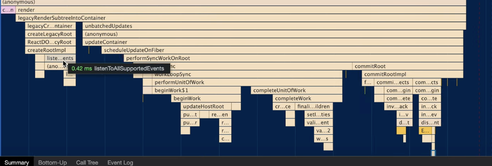

调用 ReactDOM.render发生了什么


<!--more-->

#### fixtures/packaging/babel-standalone/dev.html

```html
<html>
  <body>
    <script src="../../../build/node_modules/react/umd/react.development.js"></script>
    <script src="../../../build/node_modules/react-dom/umd/react-dom.development.js"></script>
    <script src="https://unpkg.com/babel-standalone@6/babel.js"></script>
    <div id="container"></div>
    <script type="text/babel">
      ReactDOM.render(
        <h1>Hello World!</h1>,
        document.getElementById('container')
      );
    </script>
  </body>
</html>
```

## 调用 ReactDOM.render发生了什么

render 实际就是计算差异 & commit
render 调用栈内有一系列操作



render后最先调用的是legacyRenderSubtreeIntoContainer
json形式的elements作为children传入
packages/react-dom/src/client/ReactDOMLegacy.js
第一次是没有root的 会执行initial mount
fiberRoot是？整个应用的根结点
定义了root之后
unbatchedUpdates

```javascript
  unbatchedUpdates(() => {
      updateContainer(children, fiberRoot, parentComponent, callback);
    });
```
Fiber架构
在此处理过context

```javascript
function legacyRenderSubtreeIntoContainer(
  parentComponent: ?React$Component<any, any>,
  children: ReactNodeList,
  container: Container,
  forceHydrate: boolean,
  callback: ?Function,
) {
	
}
```


tips: $0 即 可选中标签
$0.

## GUI渲染线程

JS线程

所以JS脚本执行和浏览器布局、绘制不能同时执行。

JS脚本执行 -----  样式布局 ----- 样式绘制

主流浏览器刷新频率为60Hz，即每（1000ms / 60Hz）16.6ms浏览器刷新一次。

当JS执行时间过长，超出了16.6ms，这次刷新就没有时间执行样式布局和样式绘制了。

在React中最多会同时存在两棵Fiber树。当前屏幕上显示内容对应的Fiber树称为current Fiber树，正在内存中构建的Fiber树称为workInProgress Fiber树。

> JSX在编译时会被Babel编译为React.createElement方法。
